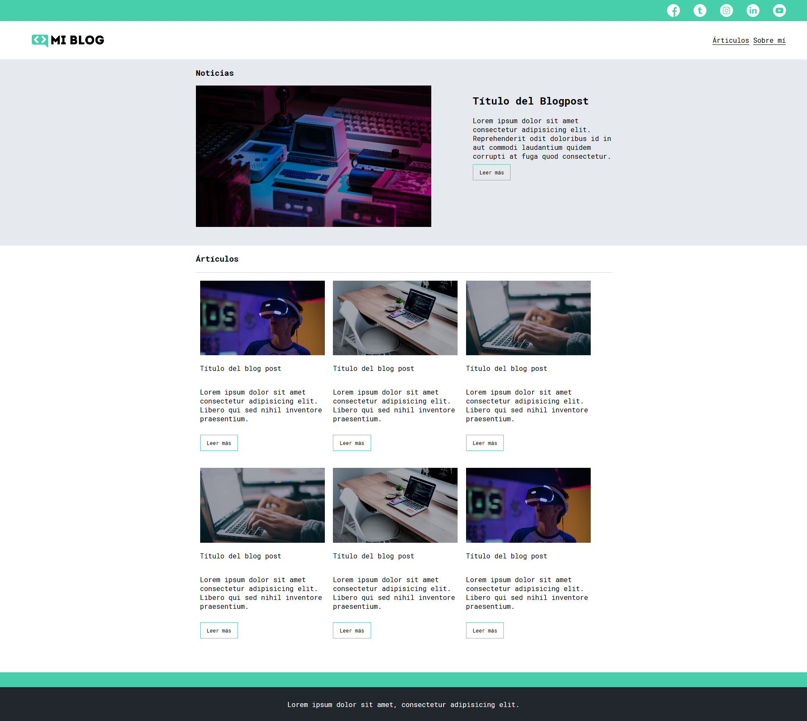
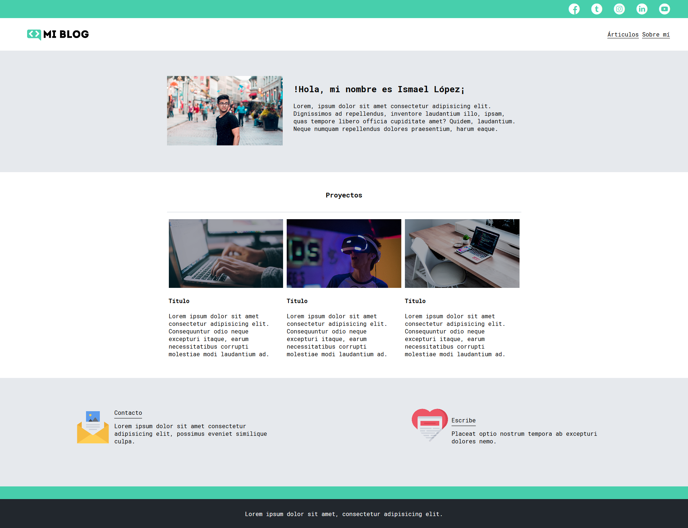

# Maquetación de sitio web con CSS GRID
___
Maquetación de un sitio web estático basado en un blog personal.

## Habilidades aplicadas
___
> Maquetar un blog estático :-)

> Hacer etiquetas para tu proyecto :-(

> Creas los estilos de tu proyecto 8-)

> Maquetar el Header, el Main y el Footer ;)

## Página --> Artículos
___

## Página --> Acerca de mí
___

